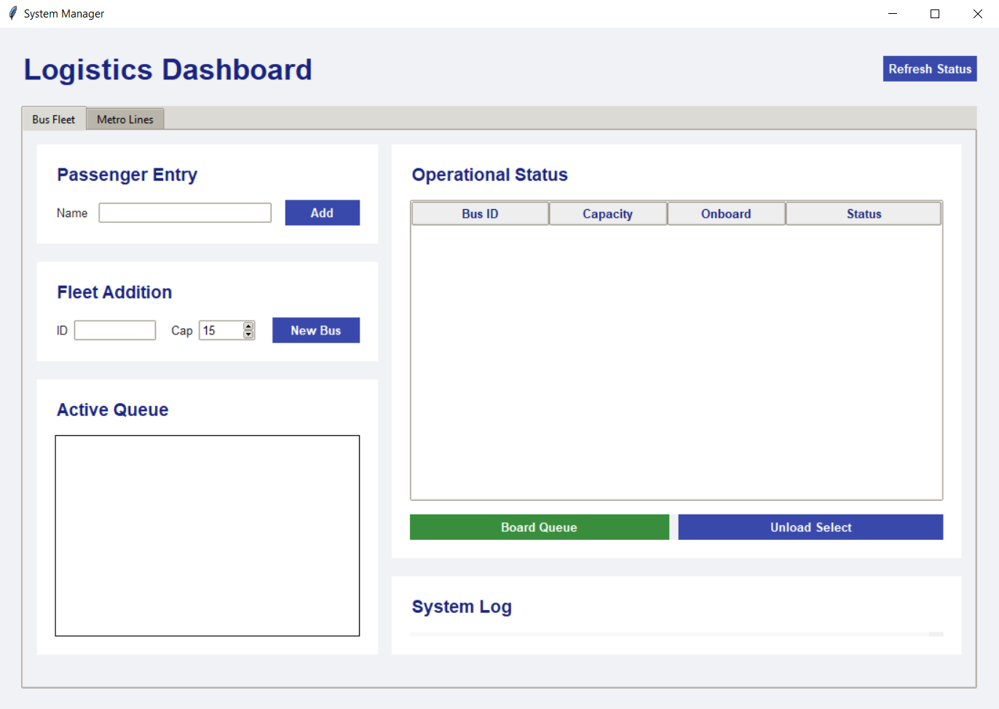
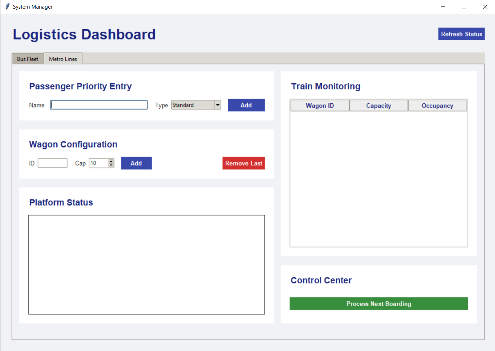

# Public Transport Management System (Bus & Metro)

A Python-based simulation application that manages logistics for a Bus Fleet and a Metro System. This project demonstrates the practical application of key **Data Structures and Algorithms (DSA)** concepts, wrapped in a modern Tkinter GUI.

## 🚀 Features

### 🚌 Bus Fleet Management (FIFO Logic)
* **Fleet Control:** Add new buses with custom capacities and unique IDs.
* **Passenger Queuing:** Passengers arrive and wait in a standard **FIFO (First-In-First-Out) Queue**.
* **Boarding System:** Automatically boards passengers from the queue into available buses until they are full.
* **Real-time Monitoring:** View the occupancy status of every bus and the current waiting list.

### 🚇 Metro Line Management (Priority & Linked List Logic)
* **Dynamic Train Composition:** The Metro train is built using a **Linked List**, where every wagon is a node. You can add wagons or remove the last wagon dynamically.
* **Priority Boarding:** Passengers are managed using a **Priority Queue**. Higher priority passengers board first based on their category:
    1.  Special Needs
    2.  Elderly
    3.  Pregnant
    4.  Standard
* **Capacity Logic:** Passengers fill wagons sequentially (Head to Tail).

## 🛠️ Data Structures Implemented

This project serves as a practical implementation of the following data structures:

| Component | Data Structure | File | Description |
| :--- | :--- | :--- | :--- |
| **Bus Queue** | `Deque` (Queue) | `queue.py` | Standard FIFO queue for bus passengers. |
| **Metro Train** | `Linked List` | `metro.py` | Wagons are nodes connected via `next` pointers. |
| **Metro Queue** | `Min-Heap` (Priority Queue) | `metro_queue.py` | Uses `heapq` to sort passengers by priority level (1-10). |
| **Fleet Storage** | `List` / `Array` | `manager.py` | Stores active Bus objects. |

## 📂 Project Structure

* **`main_ui.py`**: The entry point. Contains the `Tkinter` GUI code, styling, and event handling.
* **`manager.py`**: Controller class for the Bus system. Bridges the UI and the data models.
* **`metro_manager.py`**: Controller class for the Metro system.
* **`bus.py`**: Class defining the properties of a single Bus.
* **`queue.py`**: Implementation of the Queue wrapper class.
* **`metro.py`**: Implementation of the Singly Linked List (`WagonNode` and `Metro` classes).
* **`metro_queue.py`**: Implementation of the Priority Queue wrapper using Python's `heapq`.

## 📷 Screenshots

### Bus Management Interface

*The Bus tab demonstrating fleet management and the FIFO passenger queue.*

### Metro Management Interface

*The Metro tab demonstrating the Linked List train structure and Priority boarding.*

## 💻 How to Run

1.  **Prerequisites:**
    * Python 3.x installed.
    * `tkinter` (usually included with standard Python installations).

2.  **Installation:**
    Clone the repository or download the source code files into a single directory. Ensure your screenshot images are in the same main directory.

3.  **Execution:**
    Run the main UI file from your terminal:

    ```bash
    python main_ui.py
    ```

## 📸 Usage Guide

### Bus Tab
1.  **Add Passengers:** Enter a name in "Passenger Entry" to add them to the waiting line.
2.  **Add Bus:** Enter an ID and Capacity in "Fleet Addition" to create a new vehicle.
3.  **Board:** Click "Board Queue" to move passengers from the waiting line into the buses.

### Metro Tab
1.  **Configure Train:** Add wagons to increase the train's length (Linked List growth).
2.  **Priority Entry:** Select a passenger type (e.g., Elderly). The system assigns a priority value automatically.
3.  **Process Boarding:** Click "Process Next Boarding" to move the highest priority person into the first available wagon slot.

## 🤝 Contributing

Feel free to fork this project and submit pull requests for new features, such as:
* Unloading logic for the Metro system.
* Visualization of the Linked List nodes.
* Saving/Loading system state to a file.